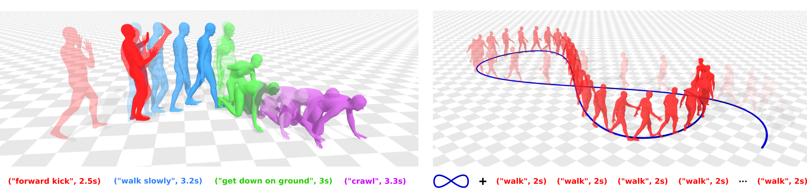

<h1 align="center">FlowMDM</h3>

<h3 align="center">Seamless Human Motion Composition with Blended Positional Encodings (CVPR'24)</h3>

  <p align="center">
    <a href="https://barquerogerman.github.io/FlowMDM/"></a>
    <a href="https://arxiv.org/abs/2402.15509"></a> 
    
  </p>

<br>

Human Motion Composition             |  Human Motion Extrapolation
:-------------------------:|:-------------------------:
  |  


## 🔎 About
<div style="text-align: center;">
    
</div>
</br>
Conditional human motion generation is an important topic with many applications in virtual reality, gaming, and robotics. 
While prior works have focused on generating motion guided by text, music, or scenes, these typically result in isolated motions confined to short durations. 
Instead, we address the generation of long, continuous sequences guided by a series of varying textual descriptions. In this context, we introduce FlowMDM, the first diffusion-based model that generates seamless Human Motion Compositions (HMC) without any postprocessing or redundant denoising steps. For this, we introduce the Blended Positional Encodings, a technique that leverages both absolute and relative positional encodings in the denoising chain. More specifically, global motion coherence is recovered at the absolute stage, whereas smooth and realistic transitions are built at the relative stage. As a result, we achieve state-of-the-art results in terms of accuracy, realism, and smoothness on the Babel and HumanML3D datasets. FlowMDM excels when trained with only a single description per motion sequence thanks to its Pose-Centric Cross-ATtention, which makes it robust against varying text descriptions at inference time. Finally, to address the limitations of existing HMC metrics, we propose two new metrics: the Peak Jerk and the Area Under the Jerk, to detect abrupt transitions.

<!--
## Running instructions
-->

## 📌 News
- [2024-03-18] Code + model weights released!
- [2024-02-27] FlowMDM is now accepted at CVPR 2024!
- [2024-02-26] Our paper is available in [Arxiv](https://arxiv.org/abs/2402.15509).

## 📝 TODO List
- [x] Release pretrained models.
- [x] Release generation (skeletons + blender support for meshes) + evaluation + training code.
- [ ] Release generation code for demo-style visualizations.

## 👩🏻‍🏫 Getting started

This code was tested on Ubuntu 20.04.6 LTS + Python 3.8 + PyTorch 1.13.0 While other versions might work as well, we recommend using this conda environment to avoid any issues.


1. Install ffmpeg (if not already installed):

```shell
sudo apt update
sudo apt install ffmpeg
```
For windows use [this](https://www.geeksforgeeks.org/how-to-install-ffmpeg-on-windows/) instead.

2. Setup conda env:
```shell
conda env create -f environment.yml
conda activate FlowMDM
python -m spacy download en_core_web_sm
pip install git+https://github.com/openai/CLIP.git
pip install git+https://github.com/GuyTevet/smplx.git
conda install ffmpeg -y
```

This [README file](https://github.com/BarqueroGerman/FlowMDM/blob/main/runners/README.md) contains instructions on how to visualize, evaluate, and train the model.

> [!NOTE]
> This repository inherits a lot of work from the original MDM and Guided-Diffusion repositories. Most of FlowMDM's contribution can be found in the `model/FlowMDM.py` and  `diffusion/diffusion_wrappers.py` files, and the `model/x_transformers` folder.

## 📚 Citation

If you find our work helpful, please cite:

```bibtex
@inproceedings{barquero2024seamless,
  title={Seamless Human Motion Composition with Blended Positional Encodings},
  author={Barquero, German and Escalera, Sergio and Palmero, Cristina},
  booktitle={Proceedings of the IEEE/CVF Conference on Computer Vision and Pattern Recognition},
  year={2024}
}
```

## 🤝🏼 Acknowledgements
- [TEMOS](https://github.com/Mathux/TEMOS): We inherit a lot of the code from TEMOS.
- [TEACH](https://github.com/athn-nik/teach): We use TEACH in our work, and inherit part of the code from them.
- [MDM](https://guytevet.github.io/mdm-page/): We use MDM in our work, and inherit as well part of the code.
- [PriorMDM](https://github.com/priorMDM/priorMDM): We use PriorMDM in our work, and inherit as well part of the code.
- [x-transformers](https://github.com/lucidrains/x-transformers): BPEs are built on their transformers library.

## ⭐ Star History


<p align="center">
    <a href="https://star-history.com/#BarqueroGerman/FlowMDM&Date" target="_blank">
        
    </a>
<p>
