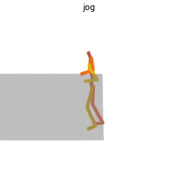

# Running FlowMDM

First, download some dependencies:
```bash
bash runners/prepare/download_smpl_files.sh
bash runners/prepare/download_glove.sh
bash runners/prepare/download_t2m_evaluators.sh
```

## 💾 Pretrained models (required for generation/evaluation)

```bash
bash runners/prepare/download_pretrained_models.sh
```

## 🗂️ Data preparation (required only for evaluation/training)

<details>

**HumanML3D dataset**:

Follow the instructions in [HumanML3D](https://github.com/EricGuo5513/HumanML3D.git),
then copy the resulting dataset to our repository:

```bash
cp -r ../HumanML3D/HumanML3D ./dataset/HumanML3D
```

**Babel dataset**:

1. Download the processed version [here](https://drive.google.com/file/d/18a4eRh8mbIFb55FMHlnmI8B8tSTkbp4t/view?usp=share_link), and place it at `./dataset/babel`.

2. Download the following [here](https://drive.google.com/file/d/1PBlbxawaeFTxtKkKDsoJwQGuDTdp52DD/view?usp=sharing), and place it at `./dataset/babel`.

</details>

## 🎬 Visualization - Option 1

To generate examples of human motion compositions with Babel model run:

```bash
python -m runners.generate --model_path ./results/babel/FlowMDM/model001300000.pt --num_repetitions 1 --bpe_denoising_step 125 --guidance_param 1.5 --instructions_file ./runners/jsons/composition_babel.json
```

To generate examples of human motion compositions with HumanML3D model run:

```bash
python -m runners.generate --model_path ./results/humanml/FlowMDM/model000500000.pt --num_repetitions 1 --bpe_denoising_step 60 --guidance_param 2.5 --instructions_file ./runners/jsons/composition_humanml.json --use_chunked_att
```

If you have downloaded the datasets, you can replace `--instructions_file FILE` with `--num_samples N` to randomly sample N textual descriptions and lengths from the datasets.

Use json files `extrapolation_babel.json`and `extrapolation_humanml.json` to generate examples of extrapolations.

Add `--use_chunked_att` to accelerate inference for very long compositions (recommended for HumanML3D, which contains very long sequences).

It will look something like this:



Tuning the `--bpe_denoising_step` will change the smoothness of the generated motion. With higher values (up to 1000), the quality of each action increases, in exchange for more abrupt and less realistic transitions between actions. Fig. 5 in the paper studies this trade-off.

### Render SMPL mesh (thanks to MDM project)

To create SMPL mesh per frame run:

```shell
python -m runners.render_mesh --input_path /path/to/mp4/stick/figure/file
```

**This script outputs:**
* `sample_rep##_smpl_params.npy` - SMPL parameters (thetas, root translations, vertices and faces)
* `sample_rep##_obj` - Mesh per frame in `.obj` format.

**Notes:**
* The `.obj` can be integrated into Blender/Maya/3DS-MAX and rendered using them.
* This script is running [SMPLify](https://smplify.is.tue.mpg.de/) and needs GPU as well (can be specified with the `--device` flag).
* **Important** - Do not change the original `.mp4` path before running the script.

**Notes for 3d makers:**
* You have two ways to animate the sequence:
  1. Use the [SMPL add-on](https://smpl.is.tue.mpg.de/index.html) and the theta parameters saved to `sample_rep##_smpl_params.npy` (we always use beta=0 and the gender-neutral model).
  1. A more straightforward way is using the mesh data itself. All meshes have the same topology (SMPL), so you just need to keyframe vertex locations. 
     Since the OBJs are not preserving vertices order, we also save this data to the `sample_rep##_smpl_params.npy` file for your convenience.
     

## 🎬 Visualization - Option 2 (fancier, like demo videos)

--- TO BE ADDED ---

## 📊 Evaluation

To reproduce the Babel evaluation over the motion and transition run:

```bash
python -m runners.eval --model_path ./results/babel/FlowMDM/model001300000.pt --dataset babel --eval_mode final --bpe_denoising_step 125 --guidance_param 1.5 --transition_length 30
```

To reproduce the HumanML3D evaluation over the motion and transition run:

```bash
python -m runners.eval --model_path ./results/humanml/FlowMDM/model000500000.pt --dataset humanml --eval_mode final --bpe_denoising_step 60 --guidance_param 2.5 --transition_length 60 --use_chunked_att
```

Add `--use_chunked_att` to accelerate inference for very long compositions (imported from LongFormer, and recommended for HumanML3D). Evaluation can take >12h for the 10 repetitions depending on the GPU power. Use `--eval_mode fast` for a quick evaluation run (3 rep.). 

> [!NOTE]
> During evaluation, generated motions are backed up to be used in successive evaluations. This is useful in case you want to change some evaluation parameters such as the `transition_length` and avoid regenerating all evaluation sequences. 


## 🏋️‍♂️ Training

To retrain FlowMDM with Babel dataset run:

```bash
python -m runners.train --save_dir ./results/babel/FlowMDM_retrained --dataset babel --batch_size 64 --num_steps 1500000 --min_seq_len 45 --max_seq_len 250 --rpe_horizon 100
```

To retrain FlowMDM with HumanML3D dataset run:

```bash
python -m runners.train --save_dir ./results/humanml/FlowMDM_retrained --dataset humanml --batch_size 64 --num_steps 600000 --rpe_horizon 150 
```

> [!NOTE]
> Even though the models released were trained for 1.3M steps (Babel) and 500k steps (HumanML3D), we observed that the random initialization and the BPE-training randomness might lead to slightly different evaluation values when re-training the models. In this case, best performance might be achieved 50-100k steps before or after the 1.3M/500k steps. See [this issue](https://github.com/BarqueroGerman/FlowMDM/issues/10) for more information.